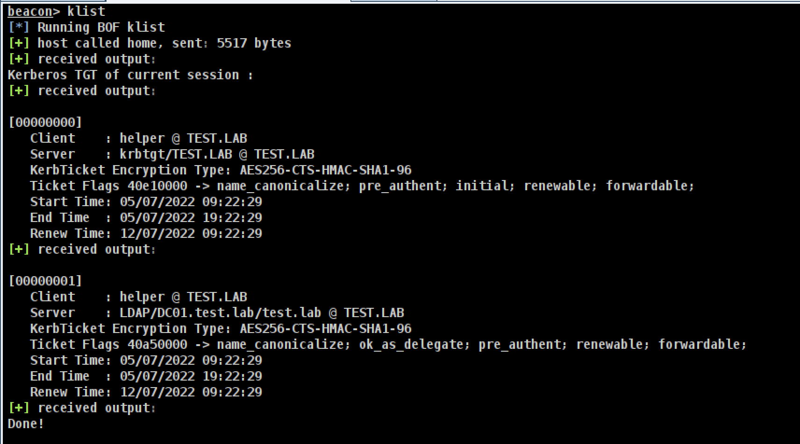

# BOF - klist 

A simple implementation of klist using Windows API, to avoid `run klist`.


----
### Usage
```
klist
```

### Compile
```
make
```
### Credits

+ [Mimikatz Kerberos module](https://github.com/gentilkiwi/mimikatz) ([@gentilkiwi](https://twitter.com/gentilkiwi))